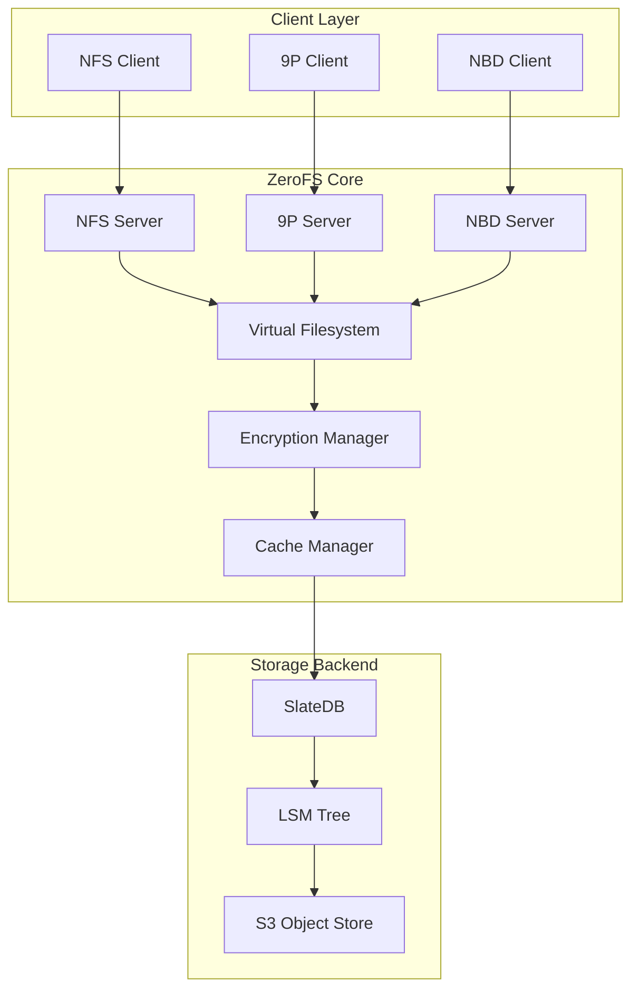

<p align="center">
  <a href="https://www.zerofs.net">
    
  </a>
</p>

<div align="center">


<a href="https://discord.gg/5PxcuUeaaT"></a>


**[Documentation](https://www.zerofs.net)** | **[QuickStart](https://www.zerofs.net/quickstart)** | **[ZeroFS vs AWS EFS](https://www.zerofs.net/zerofs-vs-aws-efs)**

</div>

# ZeroFS - The Filesystem That Makes S3 your Primary Storage
## File systems AND block devices on S3 storage

ZeroFS makes S3 storage feel like a real filesystem. It provides **file-level access via NFS and 9P** and **block-level access via NBD**.


**Key Features:**
- **NFS Server** - Mount as a network filesystem on any OS
- **9P Server** - High-performance alternative with better POSIX semantics
- **NBD Server** - Access as raw block devices for ZFS, databases, or any filesystem
- **Always Encrypted** - XChaCha20-Poly1305 encryption with LZ4 or Zstd compression
- **High Performance** - Multi-layered caching with microsecond latencies
- **S3 Compatible** - Works with any S3-compatible storage

## Testing

ZeroFS passes all tests in the [pjdfstest_nfs](https://github.com/Barre/pjdfstest_nfs) test suite - 8,662 tests covering POSIX filesystem operations including file operations, permissions, ownership, and more.

We use ZFS as an end-to-end test in our CI. [We create ZFS pools on ZeroFS](https://github.com/Barre/ZeroFS/actions/workflows/zfs-test.yml), extract the Linux kernel source tree, and run scrub operations to verify data integrity. All operations complete without errors.

We also [compile the Linux kernel on ZeroFS](https://github.com/Barre/ZeroFS/actions/workflows/kernel-compile-9p.yml) as part of our CI, using parallel compilation (`make -j$(nproc)`) to stress-test concurrent operations.

## Demo

### Compiling the linux kernel on top of S3

Compiling the Linux Kernel in 16 seconds with a ZeroFS NBD volume + ZFS

<a href="https://asciinema.org/a/730946" target="_blank"></a>

### ZFS on S3 via NBD

ZeroFS provides NBD block devices that ZFS can use directly - no intermediate filesystem needed. Here's ZFS running on S3 storage:

<a href="https://asciinema.org/a/728234" target="_blank"></a>

### Ubuntu Running on ZeroFS

Watch Ubuntu boot from ZeroFS:

<p align="center">
<a href="https://asciinema.org/a/728172" target="_blank"></a>
</p>

### Self-Hosting ZeroFS

ZeroFS can self-host! Here's a demo showing Rust's toolchain building ZeroFS while running on ZeroFS:

<p align="center">
<a href="https://asciinema.org/a/728101" target="_blank"></a>
</p>

## Architecture



## Quick Start

### Installation

#### Install script (Recommended)
```bash
curl -sSfL https://sh.zerofs.net | sh
```

#### Via Cargo
```bash
cargo install zerofs
```

#### Via Docker
```bash
docker pull ghcr.io/barre/zerofs:latest
```

### Getting Started

```bash
# Generate a configuration file
zerofs init

# Edit the configuration with your S3 credentials
$EDITOR zerofs.toml

# Run ZeroFS
zerofs run -c zerofs.toml
```

## Configuration

ZeroFS uses a TOML configuration file that supports environment variable substitution. This makes it easy to manage secrets and customize paths.

### Creating a Configuration

Generate a default configuration file:
```bash
zerofs init  # Creates zerofs.toml
```

The configuration file has sections for:
- **Cache** - Local cache settings for performance
- **Storage** - S3/Azure/local backend configuration and encryption
- **Servers** - Enable/disable NFS, 9P, and NBD servers
- **LSM tuning** - Write-ahead log, compaction, and flush settings
- **Cloud credentials** - AWS or Azure authentication

### Example Configuration

```toml
[cache]
dir = "${HOME}/.cache/zerofs"
disk_size_gb = 10.0
memory_size_gb = 1.0  # Optional, defaults to 0.25

[storage]
url = "s3://my-bucket/zerofs-data"
encryption_password = "${ZEROFS_PASSWORD}"

[filesystem]
max_size_gb = 100.0  # Optional: limit filesystem to 100 GB (defaults to 16 EiB)
compression = "lz4"  # Optional: "lz4" (default) or "zstd-{1-22}"

[servers.nfs]
addresses = ["127.0.0.1:2049"]  # Can specify multiple addresses

[servers.ninep]
addresses = ["127.0.0.1:5564"]
unix_socket = "/tmp/zerofs.9p.sock"  # Optional

[servers.nbd]
addresses = ["127.0.0.1:10809"]
unix_socket = "/tmp/zerofs.nbd.sock"  # Optional

[lsm]
wal_enabled = true  # WAL reduces compaction churn from frequent fsyncs (default: true)
                    # Disable for bulk data loading where fsyncs are rare

[aws]
access_key_id = "${AWS_ACCESS_KEY_ID}"
secret_access_key = "${AWS_SECRET_ACCESS_KEY}"
# endpoint = "https://s3.us-east-1.amazonaws.com"  # For S3-compatible services
# default_region = "us-east-1"
# allow_http = "true"  # For non-HTTPS endpoints
# conditional_put = "redis://localhost:6379"  # For S3-compatible stores without conditional put support

# [azure]
# storage_account_name = "${AZURE_STORAGE_ACCOUNT_NAME}"
# storage_account_key = "${AZURE_STORAGE_ACCOUNT_KEY}"
```

### Environment Variable Substitution

The configuration supports `${VAR}` syntax for environment variables. This is useful for:
- Keeping secrets out of configuration files
- Using different settings per environment
- Sharing configurations across systems

All referenced environment variables must be set when running ZeroFS.

### Storage Backends

ZeroFS supports multiple storage backends through the `url` field in `[storage]`:

#### Amazon S3
```toml
[storage]
url = "s3://my-bucket/path"

[aws]
access_key_id = "${AWS_ACCESS_KEY_ID}"
secret_access_key = "${AWS_SECRET_ACCESS_KEY}"
# endpoint = "https://s3.us-east-1.amazonaws.com"  # For S3-compatible services
# default_region = "us-east-1"
# allow_http = "true"  # For non-HTTPS endpoints (e.g., MinIO)
# conditional_put = "redis://localhost:6379"  # For S3-compatible stores without conditional put support
```

> **Note:** ZeroFS requires conditional write (put-if-not-exists) support for fencing. AWS S3 supports this natively. For S3-compatible object stores that do not support conditional puts, set `conditional_put` to a Redis URL. ZeroFS will use Redis to coordinate conditional write operations.

#### Microsoft Azure
```toml
[storage]
url = "azure://container/path"

[azure]
storage_account_name = "${AZURE_STORAGE_ACCOUNT_NAME}"
storage_account_key = "${AZURE_STORAGE_ACCOUNT_KEY}"
```

#### Google Cloud Storage (GCS)

**Option 1: Application Default Credentials (recommended for GCP VMs/GKE)**

If running on a GCP VM or GKE pod with an attached service account, no configuration is needed:
```toml
[storage]
url = "gs://my-bucket/path"
# No [gcp] section needed - uses VM/pod service account automatically
```

**Option 2: Service Account Key File**

```toml
[storage]
url = "gs://my-bucket/path"

[gcp]
service_account = "${GCS_SERVICE_ACCOUNT}"  # Path to service account JSON file
```

Or set the `GOOGLE_APPLICATION_CREDENTIALS` environment variable:
```bash
export GOOGLE_APPLICATION_CREDENTIALS=/path/to/service-account-key.json
zerofs server -c zerofs.toml
```

#### Local Filesystem
```toml
[storage]
url = "file:///path/to/storage"
# No additional configuration needed
```

### Server Configuration

You can enable or disable individual servers by including or commenting out their sections:

```toml
# To disable a server, comment out or remove its entire section
[servers.nfs]
addresses = ["0.0.0.0:2049"]  # Bind to all IPv4 interfaces
# addresses = ["[::]:2049"]  # Bind to all IPv6 interfaces
# addresses = ["127.0.0.1:2049", "[::1]:2049"]  # Dual-stack localhost

[servers.ninep]
addresses = ["127.0.0.1:5564"]
unix_socket = "/tmp/zerofs.9p.sock"  # Optional: adds Unix socket support

[servers.nbd]
addresses = ["127.0.0.1:10809"]
unix_socket = "/tmp/zerofs.nbd.sock"  # Optional: adds Unix socket support
```

### Filesystem Quotas

ZeroFS supports configurable filesystem size limits:

```toml
[filesystem]
max_size_gb = 100.0  # Limit filesystem to 100 GB
```

When the quota is reached, write operations return `ENOSPC` (No space left on device). Delete and truncate operations continue to work, allowing you to free space. If not specified, the filesystem defaults to 16 EiB (effectively unlimited).

### Compression

ZeroFS compresses file data before encryption. Choose between fast or high-ratio compression:

```toml
[filesystem]
compression = "lz4"      # Fast compression (default)
# or
compression = "zstd-3"   # Zstd with level 1-22
```

- **`lz4`** (default): Very fast, moderate compression ratio
- **`zstd-{level}`**: Configurable compression (1=fast, 22=maximum compression)

You can change compression at any time without migration.

### Multiple Instances

ZeroFS supports running multiple instances on the same storage backend: one read-write instance and multiple read-only instances.

```bash
# Read-write instance (default)
zerofs run -c zerofs.toml

# Read-only instances
zerofs run -c zerofs.toml --read-only
```

Read-only instances automatically see updates from the writer and return `EROFS` errors for write operations.

### Checkpoints

ZeroFS supports creating named checkpoints for point-in-time snapshots.

**Creating and managing checkpoints:**

```bash
# Create a named checkpoint (requires RPC server and running ZeroFS instance)
zerofs checkpoint create -c zerofs.toml my-snapshot

# List all checkpoints
zerofs checkpoint list -c zerofs.toml

# Get checkpoint info
zerofs checkpoint info -c zerofs.toml my-snapshot

# Delete a checkpoint
zerofs checkpoint delete -c zerofs.toml my-snapshot
```

**Opening from a checkpoint (read-only):**

```bash
# Start ZeroFS from a specific checkpoint
zerofs run -c zerofs.toml --checkpoint my-snapshot
```

**RPC server configuration** (required for checkpoint commands):

```toml
[servers.rpc]
addresses = ["127.0.0.1:7000"]
unix_socket = "/tmp/zerofs.rpc.sock"
```

### Standalone Compactor

ZeroFS uses an LSM (Log-Structured Merge) tree as its storage engine. Compaction is a background process that merges sorted data files (SSTs) to reclaim space from deleted/updated data and improve read performance by reducing the number of files to search. This process is CPU and I/O intensive.

By default, compaction runs within the main ZeroFS server. For demanding workloads, you can run a standalone compactor on a separate instance:

**Start the writer without compaction:**

```bash
zerofs run -c zerofs.toml --no-compactor
```

**Start the standalone compactor** (on the same or different machine):

```bash
zerofs compactor -c zerofs.toml
```

Both instances access the same object storage backend.

**When to use a standalone compactor:**

- **Reduce egress costs**: Run a small compactor instance in the same region/zone as your S3 bucket. Compaction reads and writes large amounts of data - keeping it in the same zone avoids cross-region data transfer fees while your main server can run anywhere.
- **Isolate resource usage**: Compaction competes with user requests for CPU and I/O. Separating it prevents latency spikes during heavy compaction.
- **Cost optimization**: Run the compactor on cheaper spot/preemptible instances since it can be safely interrupted.

The compactor uses the same configuration file and respects `[lsm].max_concurrent_compactions` for parallelism.

### Separate WAL Object Store

Every `fsync` writes to the WAL, so fsync latency equals the latency of the WAL's backing store. By default the WAL goes to the same S3 bucket as everything else. You can point it at a separate, lower-latency store instead — local NVMe, S3 Express One-Zone, a nearby S3-compatible service, etc.

```toml
[wal]
url = "file:///mnt/nvme/zerofs-wal"
```

The `[wal]` section supports its own `[wal.aws]`, `[wal.azure]`, and `[wal.gcp]` credential blocks, independent from the main storage credentials. If no `[wal]` section is present, the WAL is written to the main object store.

Whether you use a separate WAL store is decided at filesystem creation time. The underlying storage engine records this in its manifest, so you cannot add or remove a separate WAL store on an existing filesystem.

You can move the WAL to a different location by updating the `[wal]` URL and credentials, but you must manually migrate the WAL files from the old store to the new one before starting ZeroFS.

### Encryption

Encryption is always enabled in ZeroFS. All file data is compressed (LZ4 or Zstd) and encrypted using XChaCha20-Poly1305 authenticated encryption. Configure your password in the configuration file:

```toml
[storage]
url = "s3://my-bucket/data"
encryption_password = "${ZEROFS_PASSWORD}"  # Or use a literal password (not recommended)
```

#### Password Management

On first run, ZeroFS generates a 256-bit data encryption key (DEK) and encrypts it with a key derived from your password using Argon2id. The encrypted key is stored in the database, so you need the same password for subsequent runs.

To change your password:

```bash
# Change the encryption password (reads new password from stdin)
echo "new-secure-password" | zerofs change-password -c zerofs.toml

# Or read from a file
zerofs change-password -c zerofs.toml < new-password.txt
```

After changing the password, update your configuration file or environment variable to use the new password for future runs.

#### What's Encrypted vs What's Not

**Encrypted:**
- All file contents (in 32K chunks)
- File metadata values (permissions, timestamps, etc.)

**Not Encrypted:**
- Key structure (inode IDs, directory entry names)

This design is intentional. Encrypting keys would severely impact performance as LSM trees need to compare and sort keys during compaction. The key structure reveals filesystem hierarchy but not file contents.

This should be fine for most use-cases but if you need to hide directory structure and filenames, you can layer a filename-encrypting filesystem like gocryptfs on top of ZeroFS.

## Mounting the Filesystem

### 9P (Recommended for better performance and FSYNC POSIX semantics)

9P provides better performance and more accurate POSIX semantics, especially for fsync/commit operations. When fsync is called on 9P, ZeroFS receives a proper signal to flush data to stable storage, ensuring strong durability guarantees.

**Note on durability:** With NFS, ZeroFS reports writes as "stable" to the client even though they are actually unstable (buffered in memory/cache). This is done to avoid performance degradation, as otherwise each write would translate to an fsync-like operation (COMMIT in NFS terms). During testing, we expected clients to call COMMIT on FSYNC, but tested clients (macOS and Linux) don't follow this pattern. If you require strong durability guarantees, 9P is strongly recommended over NFS.

#### TCP Mount (default)
```bash
mount -t 9p -o trans=tcp,port=5564,version=9p2000.L,cache=mmap,access=user 127.0.0.1 /mnt/9p
```

#### Unix Socket Mount (lower latency for local access)
For improved performance when mounting locally, you can use Unix domain sockets which eliminate TCP/IP stack overhead:

```bash
# Configure Unix socket in zerofs.toml
# [servers.ninep]
# unix_socket = "/tmp/zerofs.9p.sock"

# Mount using Unix socket
mount -t 9p -o trans=unix,version=9p2000.L,cache=mmap,access=user /tmp/zerofs.9p.sock /mnt/9p
```

Unix sockets avoid the network stack entirely, making them ideal for local mounts where the client and ZeroFS run on the same machine.

### NFS

#### macOS
```bash
mount -t nfs -o async,nolocks,rsize=1048576,wsize=1048576,tcp,port=2049,mountport=2049,hard 127.0.0.1:/ mnt
```

#### Linux
```bash
mount -t nfs -o async,nolock,rsize=1048576,wsize=1048576,tcp,port=2049,mountport=2049,hard 127.0.0.1:/ /mnt
```

## NBD Configuration and Usage

In addition to file-level access, ZeroFS provides raw block devices through NBD with full TRIM/discard support:

```bash
# Configure NBD in zerofs.toml
# [servers.nbd]
# addresses = ["127.0.0.1:10809"]
# unix_socket = "/tmp/zerofs.nbd.sock"  # Optional

# Start ZeroFS
zerofs run -c zerofs.toml

# Mount ZeroFS via NFS or 9P to manage devices
mount -t nfs 127.0.0.1:/ /mnt/zerofs
# or
mount -t 9p -o trans=tcp,port=5564 127.0.0.1 /mnt/zerofs

# Create NBD devices dynamically
mkdir -p /mnt/zerofs/.nbd
truncate -s 1G /mnt/zerofs/.nbd/device1
truncate -s 2G /mnt/zerofs/.nbd/device2
truncate -s 5G /mnt/zerofs/.nbd/device3

# Connect via TCP with optimal settings (high timeout, multiple connections)
nbd-client 127.0.0.1 10809 /dev/nbd0 -N device1 -persist -timeout 600 -connections 4
nbd-client 127.0.0.1 10809 /dev/nbd1 -N device2 -persist -timeout 600 -connections 4

# Or connect via Unix socket (better local performance)
nbd-client -unix /tmp/zerofs.nbd.sock /dev/nbd2 -N device3 -persist -timeout 600 -connections 4

# Use the block devices
mkfs.ext4 /dev/nbd0
mount /dev/nbd0 /mnt/block

# Or create a ZFS pool
zpool create mypool /dev/nbd0 /dev/nbd1 /dev/nbd2
```

### TRIM/Discard Support

ZeroFS NBD devices support TRIM operations, which actually delete the corresponding chunks from the LSM-tree database backed by S3:

```bash
# Manual TRIM
fstrim /mnt/block

# Enable automatic discard (for filesystems)
mount -o discard /dev/nbd0 /mnt/block

# ZFS automatic TRIM
zpool set autotrim=on mypool
zpool trim mypool
```

When blocks are trimmed, ZeroFS removes the corresponding chunks from ZeroFS' LSM-tree, which eventually results in freed space in S3 storage through compaction. This reduces storage costs for any filesystem or application that issues TRIM commands.

### NBD Device Management

NBD devices are managed as regular files in the `.nbd` directory:

```bash
# List devices
ls -lh /mnt/zerofs/.nbd/

# Create a new device
truncate -s 10G /mnt/zerofs/.nbd/my-device

# Remove a device (must disconnect NBD client first)
nbd-client -d /dev/nbd0
rm /mnt/zerofs/.nbd/my-device
```

Devices are discovered dynamically by the NBD server - no restart needed! You can read/write these files directly through NFS/9P, or access them as block devices through NBD.

## Geo-Distributed Storage with ZFS

Since ZeroFS makes S3 regions look like local block devices, you can create globally distributed ZFS pools by running multiple ZeroFS instances across different regions:

```bash
# Machine 1 - US East (10.0.1.5)
# zerofs-us-east.toml:
# [storage]
# url = "s3://my-bucket/us-east-db"
# encryption_password = "${SHARED_KEY}"
# [servers.nbd]
# addresses = ["0.0.0.0:10809"]
# [aws]
# default_region = "us-east-1"

zerofs run -c zerofs-us-east.toml

# Create device via mount (from same or another machine)
mount -t nfs 10.0.1.5:/ /mnt/zerofs
truncate -s 100G /mnt/zerofs/.nbd/storage
umount /mnt/zerofs

# Machine 2 - EU West (10.0.2.5)
# Similar config with url = "s3://my-bucket/eu-west-db" and default_region = "eu-west-1"
zerofs run -c zerofs-eu-west.toml

# Machine 3 - Asia Pacific (10.0.3.5)
# Similar config with url = "s3://my-bucket/asia-db" and default_region = "ap-southeast-1"
zerofs run -c zerofs-asia.toml

# From a client machine, connect to all three NBD devices with optimal settings
nbd-client 10.0.1.5 10809 /dev/nbd0 -N storage -persist -timeout 600 -connections 8
nbd-client 10.0.2.5 10809 /dev/nbd1 -N storage -persist -timeout 600 -connections 8
nbd-client 10.0.3.5 10809 /dev/nbd2 -N storage -persist -timeout 600 -connections 8

# Create a mirrored pool across continents using raw block devices
zpool create global-pool mirror /dev/nbd0 /dev/nbd1 /dev/nbd2
```

**Result**: Your ZFS pool now spans three continents with automatic:

- **Disaster recovery** - If any region goes down, your data remains available
- **Geographic redundancy** - Data is simultaneously stored in multiple regions
- **Infinite scalability** - Add more regions by spinning up additional ZeroFS instances

This turns expensive geo-distributed storage infrastructure into a few simple commands.

## Tiered Storage with ZFS L2ARC

Since ZeroFS makes S3 behave like a regular block device, you can use ZFS's L2ARC to create automatic storage tiering:

```bash
# Create your S3-backed pool
zpool create mypool /dev/nbd0 /dev/nbd1

# Add local NVMe as L2ARC cache
zpool add mypool cache /dev/nvme0n1

# Check your setup
zpool iostat -v mypool
```

With this setup, ZFS automatically manages data placement across storage tiers:

1. NVMe L2ARC: for frequently accessed data
2. ZeroFS caches: Sub-millisecond latency for warm data
3. backend:for everything else

The tiering is transparent to applications. A PostgreSQL database sees consistent performance for hot data while storing years of historical data at S3 prices. No manual archival processes or capacity planning emergencies.

## PostgreSQL Performance

Here's pgbench running on PostgreSQL with ZeroFS + L2ARC as the storage backend:

### Read/Write Performance

```
postgres@ubuntu-16gb-fsn1-1:/root$ pgbench -c 50 -j 15 -t 100000 example
pgbench (16.9 (Ubuntu 16.9-0ubuntu0.24.04.1))
starting vacuum...end.
transaction type: <builtin: TPC-B (sort of)>
scaling factor: 50
query mode: simple
number of clients: 50
number of threads: 15
maximum number of tries: 1
number of transactions per client: 100000
number of transactions actually processed: 5000000/5000000
number of failed transactions: 0 (0.000%)
latency average = 0.943 ms
initial connection time = 48.043 ms
tps = 53041.006947 (without initial connection time)
```
### Read-Only Performance

```
postgres@ubuntu-16gb-fsn1-1:/root$ pgbench -c 50 -j 15 -t 100000 -S example
pgbench (16.9 (Ubuntu 16.9-0ubuntu0.24.04.1))
starting vacuum...end.
transaction type: <builtin: select only>
scaling factor: 50
query mode: simple
number of clients: 50
number of threads: 15
maximum number of tries: 1
number of transactions per client: 100000
number of transactions actually processed: 5000000/5000000
number of failed transactions: 0 (0.000%)
latency average = 0.121 ms
initial connection time = 53.358 ms
tps = 413436.248089 (without initial connection time)
```

These are standard pgbench runs with 50 concurrent clients. The underlying data is stored in S3, with hot data served from L2ARC and ZeroFS caches. Performance is comparable to local NVMe while the actual data resides in S3 at $0.023/GB/month.

### Example architecture

```
                         PostgreSQL Client
                                   |
                                   | SQL queries
                                   |
                            +--------------+
                            |  PG Proxy    |
                            | (HAProxy/    |
                            |  PgBouncer)  |
                            +--------------+
                               /        \
                              /          \
                   Synchronous            Synchronous
                   Replication            Replication
                            /              \
                           /                \
              +---------------+        +---------------+
              | PostgreSQL 1  |        | PostgreSQL 2  |
              | (Primary)     |◄------►| (Standby)     |
              +---------------+        +---------------+
                      |                        |
                      |  POSIX filesystem ops  |
                      |                        |
              +---------------+        +---------------+
              |   ZFS Pool 1  |        |   ZFS Pool 2  |
              | (3-way mirror)|        | (3-way mirror)|
              +---------------+        +---------------+
               /      |      \          /      |      \
              /       |       \        /       |       \
        NBD:10809 NBD:10810 NBD:10811  NBD:10812 NBD:10813 NBD:10814
             |        |        |           |        |        |
        +--------++--------++--------++--------++--------++--------+
        |ZeroFS 1||ZeroFS 2||ZeroFS 3||ZeroFS 4||ZeroFS 5||ZeroFS 6|
        +--------++--------++--------++--------++--------++--------+
             |         |         |         |         |         |
             |         |         |         |         |         |
        S3-Region1 S3-Region2 S3-Region3 S3-Region4 S3-Region5 S3-Region6
        (us-east) (eu-west) (ap-south) (us-west) (eu-north) (ap-east)
```

## Why NFS and 9P?

We support both NFS and 9P because they offer complementary advantages for network filesystems:

**NFS** is supported everywhere - macOS, Linux, Windows, BSD - without requiring any additional software. The client-side kernel implementation is highly optimized, while our server can remain in userspace with full control over the storage backend. NFS's network-first design is a natural fit for remote object storage. The protocol handles disconnections, retries, and caching in ways that have been refined over decades of production use.

**9P** provides superior performance and more accurate POSIX semantics, particularly for fsync/commit operations. Originally developed for Plan 9, it has a cleaner, simpler protocol design that's easier to implement correctly.

Both protocols share key advantages over FUSE:
- No custom kernel modules or drivers needed
- Battle-tested client implementations in every OS
- Network-first design ideal for remote storage
- Built-in handling of disconnections and retries
- Standard mounting and monitoring tools

With FUSE, we'd need to write both the filesystem implementation and a custom client driver to handle S3's network characteristics properly - latency, retries, caching strategies. NFS and 9P let us focus on what matters: building a great filesystem. The networking, caching, and client-side concerns are handled by mature implementations in every OS kernel.

For developers, this means you can mount ZeroFS using standard OS tools, monitor it with existing infrastructure, and debug issues with familiar utilities. Choose NFS for maximum compatibility, or 9P for maximum performance and POSIX FSYNC accuracy.


## Performance Benchmarks

### SQLite Performance

ZeroFS delivers excellent performance for database workloads. Here are SQLite benchmark results running on ZeroFS:

```
SQLite:     version 3.25.2
Date:       Wed Jul 16 12:08:22 2025
CPU:        8 * AMD EPYC-Rome Processor
CPUCache:   512 KB
Keys:       16 bytes each
Values:     100 bytes each
Entries:    1000000
RawSize:    110.6 MB (estimated)
------------------------------------------------
fillseq      :      19.426 micros/op;
readseq      :       0.941 micros/op;
readrand100K :       1.596 micros/op;
```

These microsecond-level latencies are 4-5 orders of magnitude faster than raw S3 operations (which typically have 50-300ms latency). This performance is achieved through:

- Multi-layered cache: Memory block cache, metadata cache, and configurable disk cache
- Compression: Reduces data transfer and increases effective cache capacity
- Parallel prefetching: Overlaps S3 requests to hide latency
- Write-ahead log (WAL): Absorbs fsyncs without flushing the memtable, preventing small SST files and reducing compaction churn. Can be disabled for bulk loading workloads where fsyncs are rare

<p align="center">
  <a href="https://asciinema.org/a/ovxTV0zTpjE1xcxn5CXehCTTN" target="_blank">View SQLite Benchmark Demo</a>
</p>

## ZeroFS vs JuiceFS

[Benchmarks comparing ZeroFS to JuiceFS](https://www.zerofs.net/zerofs-vs-juicefs)

## Key Differences from S3FS

### 1. **Storage Architecture**

**S3FS:**
- Maps filesystem operations directly to S3 object operations
- Each file is typically stored as a single S3 object
- Directories are often represented as zero-byte objects with trailing slashes
- Metadata stored in S3 object headers or separate metadata objects

**ZeroFS:**
- Uses SlateDB, a log-structured merge-tree (LSM) database
- Files are chunked into 32K blocks for efficient S3 operations
- Inodes and file data stored as key-value pairs
- Metadata is first-class data in the database

### 2. **Performance Characteristics**

**S3FS:**
- High latency for small file operations (S3 API overhead)
- Poor performance for partial file updates (must rewrite entire object)
- Directory listings can be slow (S3 LIST operations)
- No real atomic operations across multiple files

**ZeroFS:**
- Optimized for small, random I/O operations
- Efficient partial file updates through chunking
- Fast directory operations using B-tree indexes
- Atomic batch operations through SlateDB's WriteBatch

### 3. **Data Layout**

**S3FS Layout:**
```
s3://bucket/
├── file1.txt (complete file as single object)
├── dir1/ (zero-byte marker)
├── dir1/file2.txt (complete file)
└── .metadata/ (optional metadata storage)
```

**ZeroFS Layout (in SlateDB):**
```
Key-Value Store:
├── inode:0 → {type: directory, entries: {...}}
├── inode:1 → {type: file, size: 1024, ...}
├── chunk:1/0 → [first 32K of file data]
├── chunk:1/1 → [second 32K of file data]
└── next_inode_id → 2
```

### 5. **Cost Model**

**S3FS:**
- Costs scale with number of API requests
- Full file rewrites expensive for small changes
- LIST operations can be costly for large directories

**ZeroFS:**
- Costs amortized through SlateDB's compaction
- Efficient small updates reduce write amplification
- Predictable costs through batching

## GitHub Action

ZeroFS is available as a GitHub Action for easy integration into your CI/CD workflows:

```yaml
- uses: Barre/zerofs@main
  with:
    object-store-url: 's3://bucket/path'
    encryption-password: ${{ secrets.ZEROFS_PASSWORD }}
    aws-access-key-id: ${{ secrets.AWS_ACCESS_KEY_ID }}
    aws-secret-access-key: ${{ secrets.AWS_SECRET_ACCESS_KEY }}
```

This enables persistent storage across workflow runs, shared artifacts between jobs, and more.

## Filesystem Limits

ZeroFS has the following theoretical limits:

- **Maximum file size**: 16 EiB (16 exbibytes = 18.4 exabytes) per file
- **Maximum number of files over filesystem lifespan**: 2^64 (~18 quintillion)
- **Maximum hardlinks per file**: ~4 billion (2^32)
- **Maximum filesystem size**: 16 EiB (16 exbibytes = 18.4 exabytes)

These limits come from the filesystem design:
- Inode IDs and file sizes are stored as 64-bit integers
- The chunking system uses 32KB blocks with 64-bit indexing

In practice, you'll encounter other constraints well before these theoretical limits, such as S3 provider limits, performance considerations with billions of objects, or simply running out of money.

## Licensing

ZeroFS is dual-licensed under GNU AGPL v3 and commercial licenses. The AGPL license is suitable for open source projects, while commercial licenses are available for organizations requiring different terms.

For detailed licensing information, see our [Licensing Documentation](https://www.zerofs.net/licensing).
